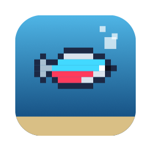
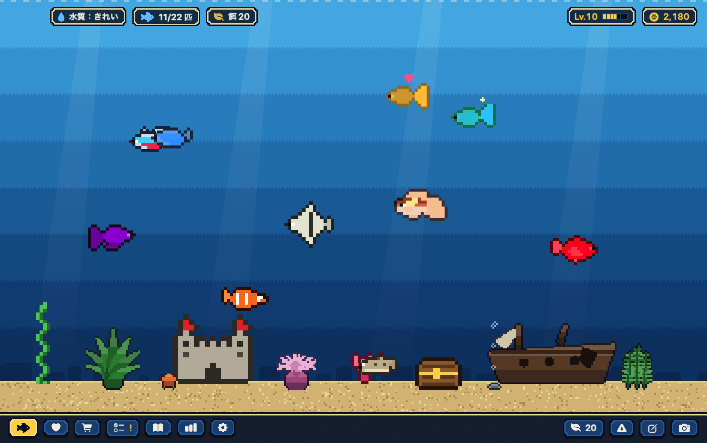
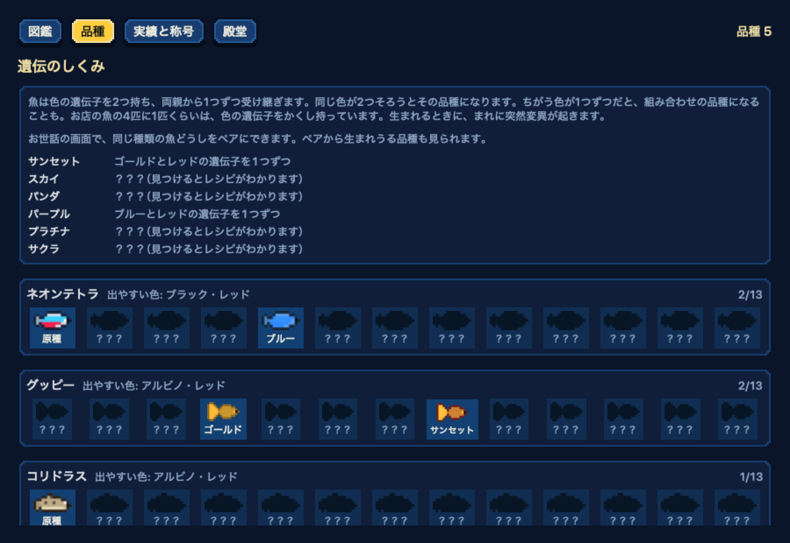
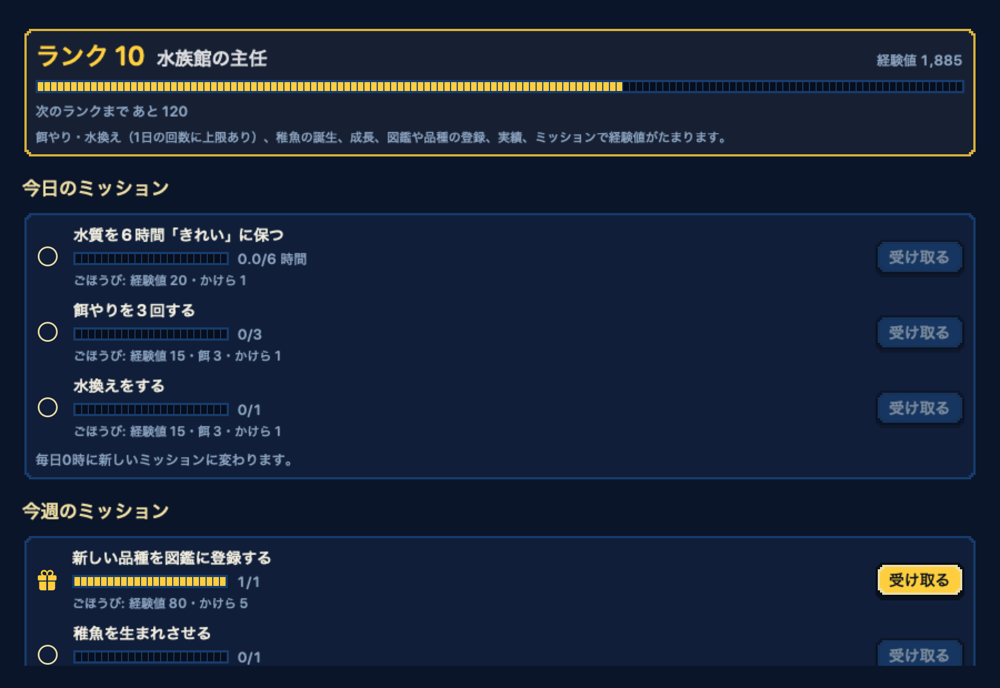

<p align="center">
  
</p>

<h1 align="center">Tokarium（トーカリウム）</h1>

<p align="center">
  <b>AIを使うほど、水槽がにぎやかになる。</b><br>
  Claude Code や Codex を使うとコインがたまり、デスクトップのドット絵の水槽で魚を育てられる Mac アプリです。
</p>

<p align="center">
  <a href="https://github.com/yuuyuu86/Tokarium/releases/latest"><b>ダウンロード</b></a> ・
  <a href="https://yuuyuu86.github.io/Tokarium/">公開ページ</a> ・
  <a href="#english">English</a>
</p>

<p align="center">
  
</p>

## しくみ

1. **いつもどおりAIを使う** — このMacに残る利用記録から、トークン数だけを読みます。
2. **コインがたまる** — 重み付きで 50万トークンが 1コイン（入力・出力は1、キャッシュ書き込みは0.25、キャッシュ読み込みは0.1 として数えます）。
3. **魚を迎えて育てる** — お店で魚や装飾を買い、餌やりと水換えで育てます。元気な成魚が2匹いると、稚魚が生まれることも。

コインになるのは、アプリを入れたあとの利用だけです。最初に魚1匹と50コイン、餌20回分をプレゼントします。

## ダウンロード

[Releases](https://github.com/yuuyuu86/Tokarium/releases/latest) から `Tokarium-x.x.x.dmg` をダウンロードし、Tokarium を「アプリケーション」フォルダへドラッグします。

- macOS 14 Sonoma 以降（Apple シリコン / Intel）
- 無料・MIT ライセンス
- Apple の公証済み。アップデートはアプリの中から受け取れます

## できること

**育てる**
- 餌やりと水換え、成長（稚魚 → 若魚 → 成魚）、病気と薬、寿命
- 繁殖と世代。魚は色の遺伝子を2つ持ち、1種類につき **13品種**。2色の組み合わせは繁殖でしか生まれません
- 性格6種となつき度。よく世話をした魚ほど、水をたたくと遠くから寄ってきます
- 群れ・掃除役・相性・共生など、魚どうしの関わり。水槽は4段階に拡張でき、魚は最大32匹

**集める**
- 魚54種（お店33・季節4・隠れた魚5・記念の魚12）と装飾57種
- 図鑑、色違い、実績27と称号、長生きした魚などを飾る殿堂
- お店に並ばない**隠れた魚**。条件がそろうと水槽に迷いこんできます
- よく使うAIごとの**記念の魚**（100・1000・5000 コインで3段階）

**遊ぶ**
- 毎日3つ・毎週2つの**ミッション**と、ランク1〜20の飼育員ランク
- ミッションのかけらで限定の装飾と交換、毎日入れかわる品種の魚の入荷
- AIをたくさん使った日の宝箱、季節のイベント（お正月・夏祭り・ハロウィン・クリスマス）
- 100点満点のレイアウト評価と、組み合わせのボーナス

**見る・聴く**
- ウィンドウ表示と、壁紙の上に水槽を置くデスクトップ表示
- ウィジェット、スクリーンセーバー、メニューバーの小窓
- 時間帯で変わる光と季節の浮遊物、昼と夜で変わるオリジナルのBGMと効果音

**安心して使う**
- 1日1回・7世代の自動バックアップ、iCloud Drive での同期
- 省電力（窓が隠れたら止める、バッテリーでは控えめに）
- Macを閉じていた間の反映は最大48時間分で、それだけで魚が死ぬことはありません
- VoiceOver、キーボード操作、「視差効果を減らす」に対応。日本語と英語

<p align="center">
  
  
</p>

## 対応しているAI

| AI | 種類 |
|---|---|
| Claude Code | 実測 |
| Claude デスクトップ（Cowork） | 実測 |
| Codex（CLI・デスクトップ） | 実測 |
| Gemini CLI / Qwen Code | 実測 |
| OpenCode | 実測 |
| GitHub Copilot CLI | 実測（試験対応） |
| Ollama | 推定（設定でオンにしたときだけコインにします） |

ChatGPT デスクトップ、Claude デスクトップのチャット、Cursor は、トークン数が Mac に残らないため読めません。

## プライバシー

- 使うのはトークン数・時刻・重複を防ぐためのIDだけです。**会話の本文は読みません。**
- 記録はこのMacの中だけで扱い、外へ送りません。APIキーやCookieにも触れません。
- 読み取り専用です。AIツールの設定や記録を書きかえることはありません。

くわしくは [PRIVACY.md](PRIVACY.md) をご覧ください。

## よくある質問

**これまで使ったぶんもコインになりますか？**
いいえ。はじめて起動したあとの利用だけです。

**複数のMacで同じ水槽を育てられますか？**
はい。iCloud Drive で同期すると、コインはMacごとのAI利用の合計になります。

**アンインストールするには？**
Tokarium をゴミ箱に入れます。データも消す場合は `~/Library/Application Support/Tokarium` を削除してください。

**不具合を見つけたら？**
アプリの「ヘルプ → 不具合を報告…」から、内容を確認したうえで [Issues](https://github.com/yuuyuu86/Tokarium/issues) に送れます。自動では送信しません。

## 開発

ビルド方法、ゲームのルールの数値、構成、リリースの手順は [DEVELOPMENT.md](DEVELOPMENT.md) にまとめています。

```bash
scripts/build_app.sh && open build/Tokarium.app
swift test
```

## ライセンス

[MIT License](LICENSE)。BGM と効果音もこのリポジトリで作ったもので、同じ MIT License です。

- [Sparkle](https://sparkle-project.org) — MIT License
- [DotGothic16](https://fonts.google.com/specimen/DotGothic16) — SIL Open Font License 1.1

---

<a id="english"></a>

## English

**The more you use AI, the livelier your tank.** Tokarium is a macOS app that turns the tokens you spend in Claude Code, Codex and other AI tools into coins. Spend them on fish and decorations for a pixel-art aquarium that lives on your desktop.

- **How it works:** Tokarium reads only token counts from usage records already on your Mac. 500,000 weighted tokens make 1 coin. Only usage after you install counts.
- **Play:** feed and breed fish (13 color varieties per species), complete daily and weekly missions, collect 54 species including hidden and memorial fish, and score your layout.
- **Everywhere:** window or desktop mode, a widget, a screen saver and a menu bar window. Original music and sound effects.
- **Privacy:** your conversations are never read, and nothing leaves your Mac.
- **Requirements:** macOS 14 or later, Apple silicon or Intel. Free and MIT licensed.

[Download the latest release](https://github.com/yuuyuu86/Tokarium/releases/latest) · [Website](https://yuuyuu86.github.io/Tokarium/)
